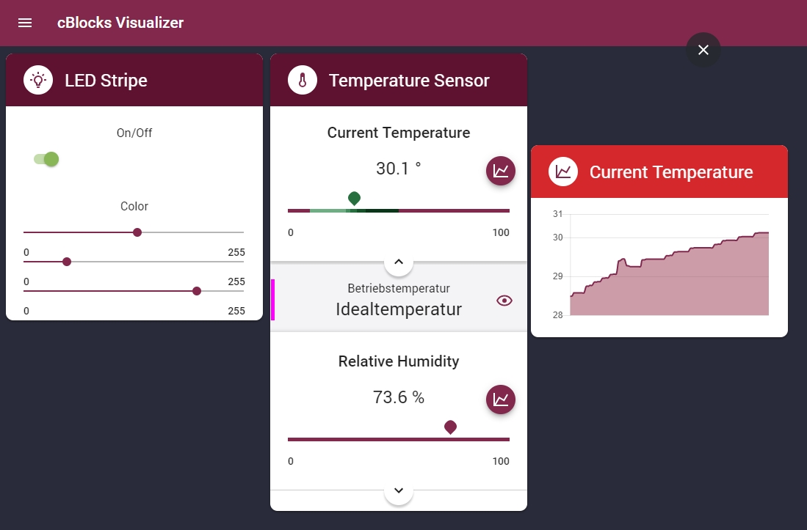

# cBlocks Visualizer

This is the visualization component for [cBlocks](https://github.com/informatik-mannheim/cblocks/). 

## Installation

The installation time of the Visualizer can be greatly shortened by clicking [this link](https://github.com/informatik-mannheim/cblocks-visualizer-bundle) and following the short instructions there. That repo contains the already bundled files of this repo.

If you prefer to have control over the build process then please continue here.

Clone this repository by running `git clone https://github.com/informatik-mannheim/cblocks-visualizer.git`.

You will require [Node.js](https://nodejs.org) for the installation of the Visualizer.
Please refer to their website for installation.

Once you have Node.js installed on your machine open the terminal and `cd` into the cblocks-visualizer directory. 

1. Run `npm install` and wait until the process is complete.
2. Run `npm run build`.
3. Copy the **bundle.js** file from the **build** folder into the **public** folder.
4. `cd` into the **src/server** folder.
5. Run `node index.js`
6. Lastly open [localhost:5000](localhost:5000) in your browser.
